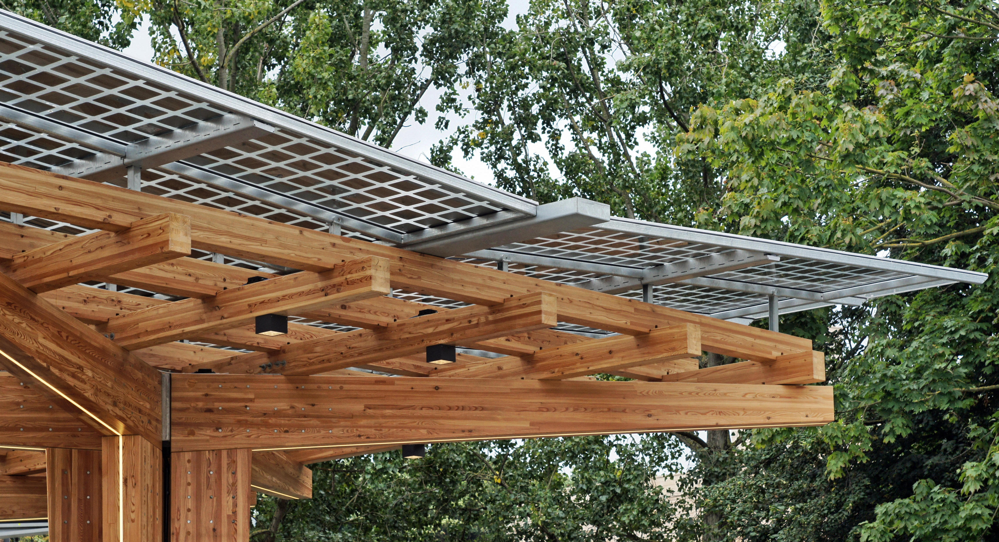

# K:Port®

### Low carbon, multi-modal transport hub from Hewitt Studios LLP

K:Port is a proven smart city & EV charging solution, designed to inspire and enable the sustainable electrification of transport.

This website introduces K:Port, demonstrates its features and partnerships, and provides access to related information.

Designed with an emphasis on accessibility, performance and responsive scaling across all window sizes. Includes light and dark modes without loading flicker.

Built using GatsbyJS, Typescript and Styled-Components, hosted with Netlify.

Visit the site: [https://kport.co.uk](https://kport.co.uk)

---

The website source code is released here under the MIT license, however the K:Port® concept and design, as well as all website contents including images, are copyright of Hewitt Studios LLP. 

K:Port® is a trademarked and registered design.

---

 

